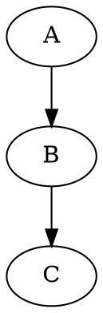
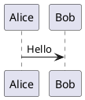

# MD to Word Converter

A browser-based Markdown workspace with live preview, diagrams, math, document export, folder browsing, presentation mode, and Word conversion. Files are processed locally in the browser unless a feature explicitly uses a remote renderer such as PlantUML.

**Live demo:** https://ajay9572.github.io/MDFileViewer/<br>
**Repository:** https://github.com/Ajay9572/MDFileViewer

## Features

- GitHub-flavored Markdown through `marked.js`, including tables, fenced code, block quotes, headings, lists, and horizontal rules
- GitHub-style alerts: `NOTE`, `TIP`, `IMPORTANT`, `WARNING`, and `CAUTION`
- Mermaid diagrams in preview and DOCX export
- Graphviz diagrams with `dot` or `graphviz` fences in preview and DOCX export
- PlantUML diagrams with `plantuml` or `puml` fences in preview and DOCX export
- KaTeX inline and display math using `$...$` and `$$...$$`
- Live preview with syntax highlighting and live refresh after folder files change
- Dark mode with persisted preference and dark Mermaid/highlight.js themes
- Right-to-left editor and preview mode
- Table of contents generated from headings
- Search within the current preview with match navigation
- Multi-file drag-and-drop and multi-select upload
- Folder browser with recursive Markdown discovery and search across files
- Presentation mode with `---` slide separators and keyboard navigation
- Interactive mind maps generated from document structure, with zoom, pan, and fit controls
- Text annotations persisted in browser storage
- DOCX export with headings, lists, tables, code, alerts, and diagrams
- HTML export
- PDF export through the browser print dialog
- Responsive layout for desktop and mobile screens

## Quick Start

The application is deployed on GitHub Pages and can be used directly from the live demo. For local development, serve it over HTTP because native ES modules do not work reliably when `index.html` is opened directly with `file://`.

```bash
cd MDFileViewer
python3 -m http.server 8765
```

Open <http://localhost:8765> in a browser.

No build step or package installation is required. Runtime libraries are loaded from CDNs.

## Usage

### Edit and Preview

Paste Markdown into the editor or upload one or more `.md`, `.markdown`, or `.txt` files. Multiple files are combined with a filename heading and a horizontal-rule separator. The preview updates as you type.

### Folder Browser

Use **Open Folder** to select a local folder. The app recursively lists Markdown files, supports search across loaded files, and polls the active file for changes every two seconds. The File System Access API is required, so this feature is primarily supported by Chromium-based browsers.

### Presentation Mode

Use **Present** to open the document as slides. Separate slides with a line containing only `---`. Navigate with the Previous/Next buttons, `ArrowLeft`, `ArrowRight`, or `Space`; press `Escape` to close.

### Mind Maps

Use **Mind Map** to transform the document structure into an interactive map. Use the toolbar to zoom in, zoom out, fit the map to the viewport, or pan around the canvas.

### Annotations

Select text in the preview and choose **Annotate**. Notes are stored in `localStorage` and appear as highlighted text. Click an annotation to view or remove it.

## Supported Syntax

### GitHub Alerts

```markdown
> [!WARNING]
> This action cannot be undone.
```

### Mermaid

````markdown

````

### Graphviz

````markdown

````

### PlantUML

````markdown

````

PlantUML preview and DOCX export require network access to the public PlantUML server.

### KaTeX

```markdown
Inline math: $E = mc^2$

$$
\sum_{i=1}^{n} i = \frac{n(n+1)}{2}
$$
```

## Export

- **DOCX** creates a Word document and validates its generated ZIP/XML package before download.
- **HTML** downloads a standalone styled HTML document.
- **PDF** opens a browser print dialog. Choose **Save as PDF** there.

## Project Structure

```text
MDFileViewer/
├── index.html
├── README.md
└── src/
    ├── app.js
    ├── annotations/
    │   └── store.js
    ├── diagrams/
    │   ├── graphviz.js
    │   ├── plantuml.js
    │   └── svg-to-image.js
    ├── docx/
    │   ├── alerts.js
    │   ├── code.js
    │   ├── converter.js
    │   ├── lists.js
    │   └── tables.js
    ├── export/
    │   ├── document-template.js
    │   ├── html-export.js
    │   └── pdf-export.js
    ├── file/
    │   └── file-handler.js
    ├── folder/
    │   └── browser.js
    ├── markdown/
    │   ├── alerts.js
    │   ├── math.js
    │   ├── parser.js
    │   ├── renderer.js
    │   └── toc.js
    ├── mermaid/
    │   └── renderer.js
    ├── mindmap/
    │   └── renderer.js
    ├── presentation/
    │   └── slides.js
    └── ui/
        ├── annotations.js
        ├── direction.js
        ├── folder-panel.js
        ├── mindmap.js
        ├── modal.js
        ├── notifications.js
        ├── presentation.js
        ├── preview.js
        ├── search.js
        ├── theme.js
        └── toc.js
```

## Runtime Versions

The application currently loads these browser libraries from CDN:

| Library | Version | Purpose |
| --- | --- | --- |
| docx | 8.5.0 | DOCX generation |
| JSZip | 3.10.1 | DOCX package validation |
| Mermaid | 10.x | Mermaid diagrams |
| marked | CDN latest | Markdown/GFM parsing |
| highlight.js | 11.8.0 | Code syntax highlighting |
| `@viz-js/viz` | 3.11.0 | Graphviz rendering |
| pako | 2.1.0 | PlantUML compression |
| D3 | 7.x | Mind map dependency |
| markmap-lib | 0.18.12 | Mind map transformation |
| markmap-view | 0.18.12 | Mind map rendering |
| markmap-toolbar | 0.18.12 | Mind map zoom/pan controls |
| KaTeX | 0.16.11 | Math rendering |
| Tailwind CSS | CDN latest | UI utilities |

## Browser Requirements

- Modern Chrome, Edge, Firefox, or Safari for the editor, preview, exports, and diagrams
- Chromium-based browser for **Open Folder** because it uses `showDirectoryPicker()`
- Network access for CDN libraries and PlantUML rendering
- Browser print support for PDF export

## Privacy

Markdown files and generated DOCX/HTML content are processed in the browser. Folder access is granted only after the browser folder picker is used. PlantUML definitions are sent to the configured public PlantUML server when PlantUML rendering is requested.

## Troubleshooting

- If the page is blank, serve the project over HTTP and check the browser console for failed CDN requests.
- If a diagram does not render, verify its fence language and network access.
- If PDF export appears to do nothing in automation, remember that it intentionally opens the native print dialog.
- If folder browsing is unavailable, use a Chromium-based browser or upload files directly.
- If the preview appears stale, reload the page and confirm that the CDN resources are reachable.

## License

This project is open source and free to use for personal and commercial purposes.
